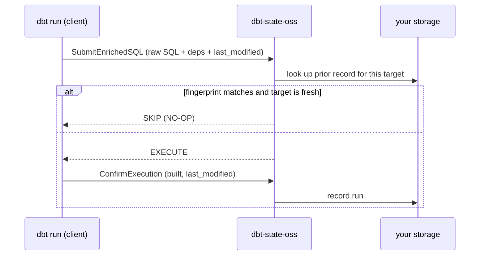

# How it works

## The client/server split

- **Client (unchanged, Apache-2.0):** compiles model SQL, extracts deps + table
  refs (sqlglot), reads each input's `last_modified` from the warehouse, hashes
  seed files, ships **raw SQL + metadata** over gRPC, acts on the verdict, and
  reports outcomes back.
- **Server (this project):** computes a semantic fingerprint, matches it against
  stored history for the target table, checks **freshness** + execution type, and
  returns **skip / execute / clone**. Persists run records to your chosen backend.

The fingerprint only has to be **self-consistent** between recording a run and
checking one — it does not need to match dbt Labs'.

## Why it's correct (freshness)

A skip is safe only when **both** hold: the model's own SQL is unchanged
(fingerprint match) **and** the target was built *after* every input's last
change (freshness). dbt builds upstreams first, so a changed upstream carries a
newer timestamp than the downstream's last build → stale → rebuild. That's what
keeps the cache from ever returning stale data.

## Verified behavior

| scenario | result |
|---|---|
| second run, nothing changed | all models **NO-OP** (reused, no SQL run) |
| comment / whitespace-only edit | **NO-OP** (semantic fingerprint) |
| real SQL change to a model | that model rebuilds |
| real change upstream | downstream rebuilds too (freshness check) |
| seed file unchanged | seed **NO-OP** (via values_hash) |
| dev run, model not built in dev | reads its upstream from prod (defer-to-prod) |

## No manifest

There's no `manifest.json` to manage. Selection of changed models is git-based
(`git:<branch>`), the skip decision is the server's per-model verdict, and
defer-to-prod is dbt's native deferral resolved from your prod profile —
all resolved live, nothing to ship between runs.
