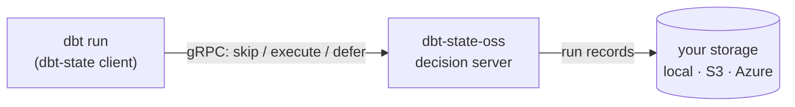

---
hide:
  - navigation
  - toc
---

# dbt-state-oss

**Skip redundant dbt model runs and auto-defer to prod — without a manifest, and
without a metered hosted service.** An open-source, self-hosted decision server
for the Apache-2.0 [`dbt-state`](https://github.com/dbt-labs/dbt-state) client,
keeping all state in **your own storage**.

[Get started](install.md){ .md-button .md-button--primary }
[View on GitHub](https://github.com/sudo-pradip/dbt-state-oss){ .md-button }
[PyPI](https://pypi.org/project/dbt-state-oss/){ .md-button }

```bash
pip install dbt-state-oss
```

---

## How it fits



The official `dbt-state` client compiles your model SQL and asks a decision
server, per model, *"has this already been built and is it still fresh?"* — and
skips (NO-OP) or defers to prod when it can. dbt Labs runs that server as a
**metered, hosted** service. **dbt-state-oss is the open server you run yourself**,
backed by storage you own.

---

## dbt-state-oss vs hosted dbt State

| | hosted dbt State | dbt-state-oss |
|---|---|---|
| Decision server | dbt Labs, hosted (`api.state.dbt.com`) | **you self-host** (Apache-2.0) |
| State storage | dbt Labs' cloud | **your own** — local, S3, or Azure Blob |
| Account required | dbt platform / `app.state.dbt.com` | none for dev; **your own** OAuth/Entra ID for prod |
| Cost | metered | free (you run the server) |
| dbt client | the `dbt-state` client | the **same** `dbt-state` client, unchanged |
| Protocol | proprietary server | the **same** open gRPC protocol |
| dbt engines | Core / Fusion | Core 1.7–1.11, Core 1.12+, Fusion (preview) |

*Not affiliated with dbt Labs. dbt-state-oss is an independent, open
implementation of the server side of the Apache-2.0 client's protocol.*

---

## Quick taste

```bash
# 1. run the server (state in a local dir; or --store s3/azure)
pip install dbt-state-oss
dbt-state-oss --store local --port 50051

# 2. point dbt at it, then build twice — the second run NO-OPs
export RUN_CACHE_API_URL=localhost:50051 RUN_CACHE_API_SECURE=false RUN_CACHE_OAUTH_CLIENT_SECRET=dev
dbt build
```

[Read the install guide →](install.md){ .md-button }
